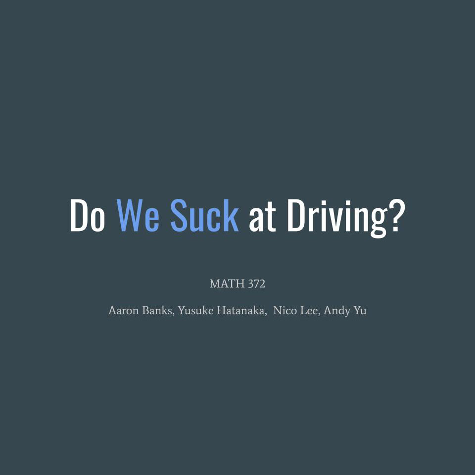

For the Fall '19 semester in MATH 372 we had to do a group project consisting of a statistical analysis of an issue relating to Hawaii. Our team chose to analyze the driving patterns of licensed drivers across the 4 major counties in the Hawaiian Islands - Honolulu, Hawai'i, Kauai, and Maui. Using the publicly available State of Hawaii Data Book along with resources from The Department of Business, Economic Development & Tourism Research, we extracted the data pertaining to the number of active licenses, miles travel by vehicle, and the total number of accidents.

 

Using the powerful statistics software Minitab, along with basic R and Excel programming, we were able to build graphs showing the relationships between the different factors across the 4 counties, along with performing more detailed statistical analysis' such as inteval plots, difference of means, normal probability plots, one-way ANOVA, and Tukey comparisons.

My role on the team was to filter and clean up the information needed from the State of Hawaii Databook into a format that was useable for Minitab and other analysis, along with using R to compute probablistic values. I was also responsible for the presentation slides itself and the overall visual structure.

