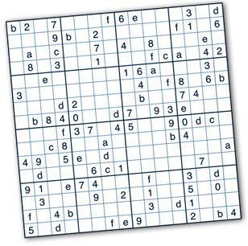

When learning about recursion in ICS 211 we were tasked with writing recursive methods to solve a 16x16 hexadecimal sudoku. The sudoku would be considered valid if each of the rows, columns, and 4x4 boxes contained exactly one each of the values 0 through F. 

The basic recursive strategy to find a solution:

1. If all cells are filled check if the solution is valid. If not, this Sudoku is not a solution.
2. If at least one cell is not filled, see what possible values are for the cell.

- If no values are possible then this is not a solution.
- If one or more values are possible place each value in the cell one at a time and recursively attempt to find a solution that fills the remaining empty cells.

If no solution is found for any possible value the cell will be reset to its previous value. 

This algorithm implemented is what is called **backtracking**. This means that at any point in the search, it will try any one of the possible values, and it it doesn’t work, return to that point and try a different value until all the possible values have been tried.

```java
  public static boolean solveSudoku(int[][] sudoku) {
    for (int row = 0; row < sudoku.length; row++) {
      for (int column = 0; column < sudoku.length; column++) {
        int cell = sudoku[row][column];

        if (cell == -1) {
          ArrayList<Integer> values = legalValues(sudoku, row, column);
          for (Integer val : values) {
            sudoku[row][column] = val;
            if (solveSudoku(sudoku)) {
              return true;
            } else {
              sudoku[row][column] = -1;
              counter++;
            }
          }
          return false;
        }
      }
    }
    return true;
  }
```

While the main code was provided for us by the instructor, we were responsible for implementing at least the `solveSudoku` and `legalValues` methods which I have shown above and below:

```java
  public static ArrayList<Integer> legalValues(int[][] sudoku, int row, int column) {
    ArrayList<Integer> values = new ArrayList<>();

    int cell = sudoku[row][column];
    if (cell == -1) {
      for (int i = 0; i < sudoku.length; i++) {
        if (goodValue(sudoku, row, column, i)) {
          values.add(i);
        }
      }
      return values;
    }
    return null;
  }
```

