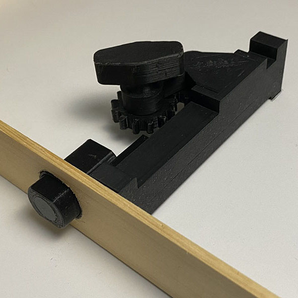

For Physics 171 at Leeward Community College we held a hackathon in which teams had to develop a project that used some sort of physical sensor. Our team chose to use magnetic hall effect sensors to build a "smart" door and lock combo that would give feedback to the user on the status of both the door and the lock. Through both console output, and visually using RGB LEDs, we were able to build a concept door and lock system that would report to the user whether the door was open or closed and either locked or unlocked.

For this project, I was the resonsible for the design of the lock mechanism and 3d printing. I sketched out various ideas on paper before modeling the lock in 3d and printing it out. Magnets were embedded throughout in order to get feedback from the hall sensor, and also to have a quick remove knob that would allow the face of the door to be removed and access the internal system. We finished in first place within the class.

