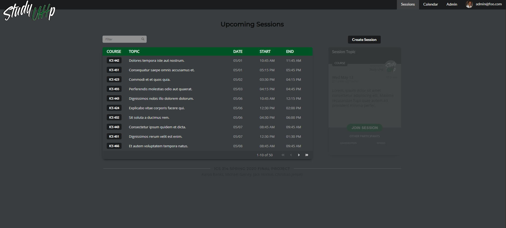
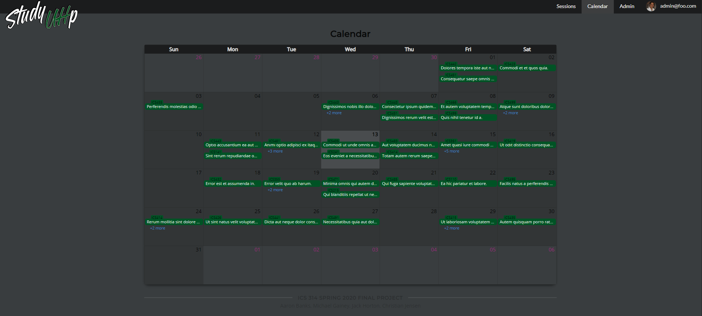
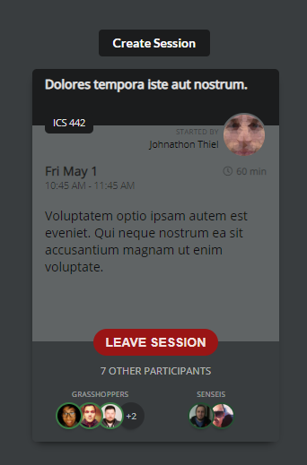

The final project for Spring 2020 class of ICS 314 students was a team project consisting of developing a website that would benefit students of UH Manoa. Our team was assigned to build a "study buddy" application that would promote group study amongst ICS students and utilize the ICSpace located on campus. Our knowledge gained of Javascript, React, Meteor, and MongoDB would form the basis of the tools available to us to complete this task, along with the vast ecosystem that each piece of software had.

<br>

#### The Website





Our application we developed was named Study UHp. It allowed students to register for an account, after which they could access the listing of upcoming study sessions available in both a table view and calendar view, and join the session if desired. Users could also create a session to which other users could join, and edit their session information if needed.



The session listing would display all the necessary information about it, including the course, topic, short description, the start and end dates, and the list of participants. Our participants were broken up into two categories, grasshopper - those who sought to learn, and sensei - those who sought to share knowledge.

<br>

> Chances are by the time you read this the production version is no longer online, but you can try this link:
>
> http://studyuhp.meteorapp.com/
>
> However, the full source code is available to view at:
>
> https://github.com/study-uhp/study-uhp

<br>

#### Data, data, and more data...

Early on we discovered a problem with our application regarding the session information - they were difficult and time consuming to create by hand and care had to be taken to link all of the information together. Users should not be making sessions for courses they did not have listed as one of their own, a freshman student should not end up as a sensei for a senior level course and vice versa, sessions times should fall within a certain timeframe and be a realistic length, and even more. All of this had to be taken into account when creating a new session and keeping track of its owner, the participants, and all the respective user profiles. Making each of these user profiles and sessions by hand in a large enough amount to test the full functionality of the website was taking too long and prone to too many errors. So I did what any good programmer who wants to be lazy would do, I wrote a program to do it for me.

Utilizing the [faker.js](https://github.com/marak/Faker.js/) library which could create large amounts of fake information very quickly, [dayjs](https://github.com/iamkun/dayjs) for handling anything related to dates and times, along with creating some pre-defined arrays of student-specific and Hawaii-specific data to pluck and sample from using [Underscore](https://github.com/jashkenas/underscore), I created two data generators in order to have a much more rich and realistic database for the website to utilize. I built in sets of "rules" that would first create an entire database of users, pulling information from our course listing database, allowing different year students to only have a range of classes that would be fitting to their level. Along with their course listing bases on their random year level, it would generate a random major, first name, last name, email address @hawaii.edu, pull in a random avatar image and a pseudo-random user bio. Values were cached in order to keep consistency among things like the generate email address and bio instead of replacing the information with a new random user each time.

```jsx
  // A portion of the code from usergenerator.js
  if (year === 'Freshman') {
    const s = _.filter(courses, function (c) {
      return c.charAt(0) === '1';
    });
    courseObj.sensei = _.sample(s, _.random(1, 2));
    const newcourses = _.difference(courses, courseObj.sensei);
    const g = _.filter(newcourses, function (c) {
      return (
        c.charAt(0) === '1' ||
        c.charAt(0) === '2'
      );
    });
    courseObj.grasshopper = _.sample(g, _.random(1, 5));
  }
```


After populating the database with the generated users, the session generator uses that information to build a database of sessions. It generate them based on a range of days and times from the current date forward, and with a weighted realistic length. It picks a course at random and assigns the session to a user based on the user database, and then a picks a random selection of participants for both grasshopper's and sensei's while taking care not to duplicate any users across any category. The faker.js library provides topics and descriptions which are just random Latin words, something that is not completely ideal but saves a large amount of time of trying to realistically input ones ourselves.

```jsx
  // A portion of the code from sessiongenerator.js
  const sessionObj = {
    course: _.sample(courselist),
    topic: faker.lorem.sentence(5),
    description: faker.lorem.sentences(_.random(2, 3)),
    start: start.format(),
    end: end.format(),
    owner: owner,
    participants: {
      grasshopper: grasshoppers,
      sensei: senseis,
    },
  };
```


All of this boils down to two functions, `generateUsers()` and `generateSessions()`, and one small snippet in our `settings.json` file which makes it very easy to run local builds with a smaller database of users/sessions, and ramp it up to larger numbers for production.

```json
  "generateData": {
    "users": 15,
    "sessions": 50
  }
```


This functionality was not *needed*, but since the bulk of our application is really just an interface for interacting with this data it was very beneficial to be able to work with large amounts of it that all tied together so well. It saved us a good deal of time from creating each user and session by hand, and let us fill out our table and calendar within seconds. I learned quite a bit just from this alone even though it is not an actual feature of the website. How to leverage libraries created by others, creating custom functions that adhere to conditional rules, generating objects full of linked data and interfacing with Meteor and MongoDB. It was quite a learning process and one I feel increased my skills as a software engineer.

<br>

#### Afterthoughts

Team management and the use of GitHub were two new skills that were heavily utilized during this project. It was interesting to use the knowledge we gained from the semester and apply it to a develop a full application as a team and in a full remote setting no less. The situation we faced, although small in scale, is not far off from what would be encountered in the real world as a software engineer. There were good and bad moments of learning to communicate and work together as a team, and in the end there are many areas in which we could improve. This overall was a great learning experience, and I can now say I feel much more comfortable using GitHub and all its available tools. Learning to manage issues and project boards, making branches for development work, creating pull requests to merge your work back into the master branch, and resolving merge conflicts are all skills I feel much more confident in now.


This semester in ICS 314 has taught me the most in my ICS journey so far no doubt, something I would not have envisioned at the beginning to be honest. The pace was slow at first, and I had little interest in Javascript thinking it was much simpler than it is and only used to "make websites look better." I could not have been more wrong. I learned just how powerful of a language it is, and how it has a massive ecosystem that spans all levels from frontend to backend, and just how many interesting and cool things it can do. We learned about frameworks, libraries, hosting, databases, working as a team, version control, working under pressure and constraints, writing as an engineer and much more. I am excited to continue my pursuit of Computer Science, and looking forward to increasing my skills using Javascript and all that surround it.


